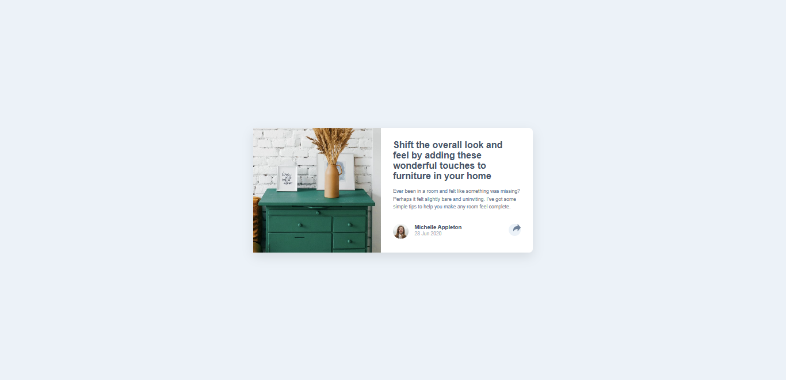

# Frontend Mentor - Article preview component solution


This is my solution to the [Article Preview Component challenge on Frontend Mentor](https://www.frontendmentor.io/challenges/article-preview-component-dYBN_pYFT). It's a great project to practice responsive layouts, component-based design, and simple interactivity using JavaScript.

## Table of contents

- [Overview](#overview)
  - [The challenge](#the-challenge)
  - [Screenshot](#screenshot)
  - [Links](#links)
- [My process](#my-process)
  - [Built with](#built-with)
  - [What I learned](#what-i-learned)
  - [Continued development](#continued-development)
  - [Useful resources](#useful-resources)
- [Author](#author)
- [Acknowledgments](#acknowledgments)


## Overview

### The challenge

Users should be able to:

- View the optimal layout for the component depending on their device's screen size
- See the social media share links when they click the share icon

### Screenshot




### Links

- Solution URL: [Add solution URL here](https://github.com/puja-oli/article-preview-component)
- Live Site URL: [Add live site URL here](https://puja-oli.github.io/article-preview-component/)

## My process

### Built with

- Semantic HTML5 markup
- CSS custom properties
- Flexbox
- CSS Grid
- Mobile-first workflow


### What I learned

During this project, I learned several key concepts in HTML, CSS, and JavaScript that enhanced my skills:

Responsive Design: I learned how to use media queries to ensure a layout adapts to different screen sizes, like adjusting the card layout and hiding/showing elements for mobile vs. desktop views.


To see how you can add code snippets, see below:

```html
<h1>Some HTML code I'm proud of</h1>
<div class="card">
  <div class="card-image">
    
  </div>
  <div class="card-content">
    <h1>Title</h1>
    <p>Description</p>
  </div>
</div>
```
```css
.card-image img {
  transition: all 0.3s ease-in-out;
}
```
```js
function showTooltip() {
  tooltip.innerHTML = tooltipContent;
  tooltip.classList.remove("hidden");
}
```


### Continued development

For future projects, I want to focus on:

Responsive Design: Ensuring that components and layouts work smoothly across all screen sizes, especially when using media queries and flexible layouts.

JavaScript DOM Manipulation: I’d like to explore more complex interactions like handling dynamic content and animations based on user actions (like toggling tooltips or popups).

Accessibility: Ensuring my components are accessible, especially by using semantic HTML tags and adding appropriate ARIA roles.

Performance Optimization: Refining the code for faster loading and optimizing images and other resources for improved performance, especially on mobile devices.


### Useful resources

- MDN Web Docs - HTML and javascript- This resource has been invaluable for understanding the ins and outs of HTML tags, attributes, and best practices. I found it especially helpful when learning about semantic HTML elements and their proper use in modern web development.
- CSS-Tricks - Flexbox Guide - The Flexbox guide helped me understand how to build layouts that adjust smoothly to various screen sizes. This guide has been essential for creating flexible, responsive designs.

## Author

- Frontend Mentor - [@puja-oli](https://www.frontendmentor.io/profile/puja-oli)


## Acknowledgments

A big thank you to Frontend Mentor for providing such a well-structured and challenging project that helped me improve my front-end skills.

I would also like to acknowledge the MDN Web Docs for their comprehensive and clear explanations, which were invaluable when working on HTML, CSS, and JavaScript aspects of this project.

Special thanks to the community at Stack Overflow for the quick and insightful solutions that helped me troubleshoot and refine certain parts of the code, especially around the responsive design and tooltip functionality.

Lastly, I gained inspiration from various online articles and tutorials, which helped me enhance the functionality and design of the component.